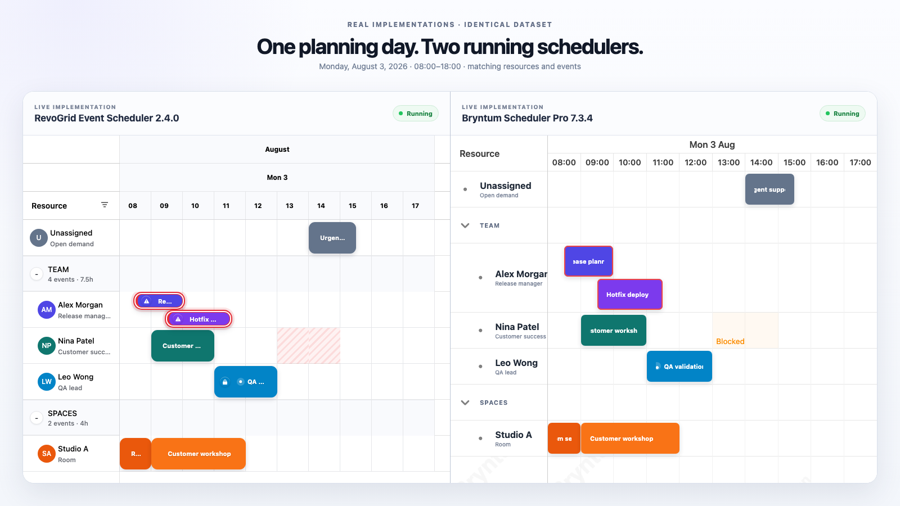
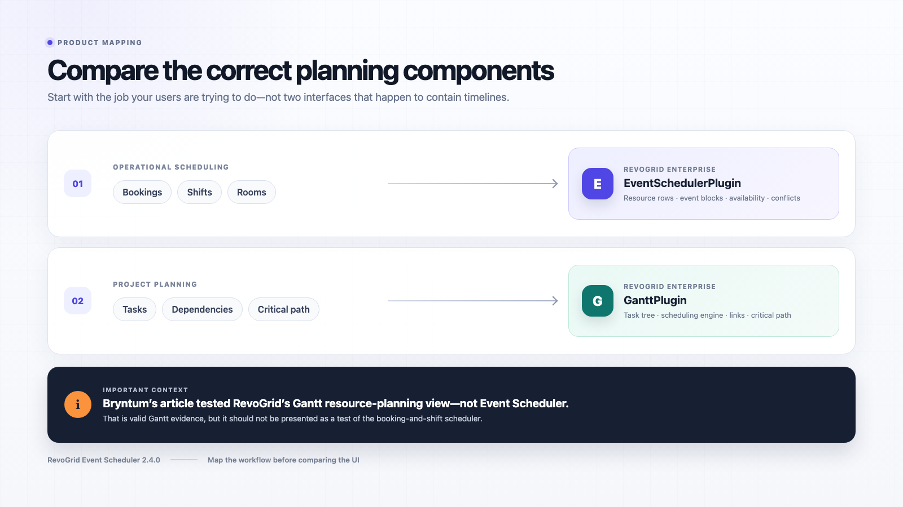
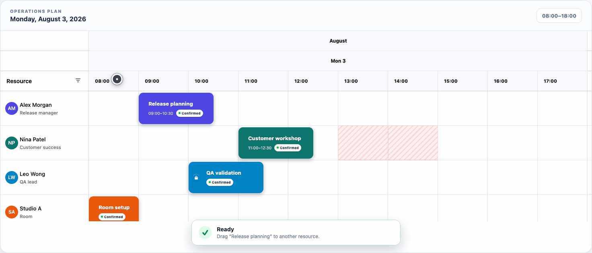

# RevoGrid Scheduler Review Samples

Reproducible source and article media for an honest scheduler comparison. The repository keeps the product boundary explicit and uses real running components wherever a product UI is shown.

[Open the live samples](https://benchmark.rv-grid.com/revogrid-scheduler-review-samples/).



## Samples

| Sample | Page | What it proves |
| --- | --- | --- |
| 01 — Live comparison | `comparison.html` | RevoGrid Event Scheduler 2.4.0 and Bryntum Scheduler Pro 7.3.4 running with the same resources, events, date range, and viewport. |
| 02 — Product mapping | `mapping.html` | Bookings/shifts/rooms map to `EventSchedulerPlugin`; tasks/dependencies/critical path map to `GanttPlugin`. |
| 03 — Drag/drop proof | `proof.html` | A real cross-resource move followed by a blocked-time rejection with unchanged controlled event state. |

The shared comparison data is in [`src/shared/data.js`](src/shared/data.js). Full methodology is in [`docs/methodology.md`](docs/methodology.md).

### Product mapping



### Real interaction proof



The GIF and MP4 are cropped to the white scheduler stage for clean embedding in documentation and examples. The recorder drives the real component with browser pointer events and asserts the resulting controlled state before exporting either file.

## Generated media

- [`public/assets/live-comparison.png`](public/assets/live-comparison.png) — 1600×900 hero
- [`public/assets/product-mapping.png`](public/assets/product-mapping.png) — 1600×900 mapping diagram
- [`public/assets/event-scheduler-proof.gif`](public/assets/event-scheduler-proof.gif) — cropped looping proof
- [`public/assets/event-scheduler-proof.mp4`](public/assets/event-scheduler-proof.mp4) — cropped H.264 proof video

## Run locally

Requirements: Node.js 24.13.0, pnpm, and GitHub Packages access to the RevoGrid trial packages. Bryntum's public Scheduler Pro trial alias is declared exactly as recommended by Bryntum.

```bash
export NODE_AUTH_TOKEN=YOUR_GITHUB_PACKAGES_TOKEN
pnpm install
pnpm dev
```

Open:

- <http://127.0.0.1:5173/comparison.html>
- <http://127.0.0.1:5173/mapping.html>
- <http://127.0.0.1:5173/proof.html>

## Rebuild article assets

Install Playwright Chromium once, and install FFmpeg if you want to regenerate the GIF or MP4.

```bash
pnpm exec playwright install chromium
pnpm capture
pnpm capture:proof
```

`capture:proof` does not merely animate DOM elements. It drags the actual RevoGrid event, checks the accepted resource assignment, attempts the invalid blocked-time drop, and fails if the final controlled event state is not the expected rejected result.

## Trial packages and Pages

The public reproduction pins exact npm aliases to `@revolist/rv-pro-trial@2.4.0` and `@revolist/rv-enterprise-trial@2.4.0`; it does not install the main Pro or Enterprise distributions. The Pages workflow uses the repository `GITHUB_TOKEN` with `packages: read`. The repository must therefore have read access to both trial packages.

Vite accepts `VITE_BASE_PATH` so the same build runs at the standard project Pages path and at the benchmark hub path. Trusted pushes to `main` deploy the standalone project site; the benchmark hub publishes the same build under `/revogrid-scheduler-review-samples/`.

## Licensing

The sample source in this repository is MIT-licensed. RevoGrid and Bryntum trial packages remain governed by their respective licenses. No vendor package source or bundle is committed here; package dependencies are installed by the reader or the Pages workflow.
